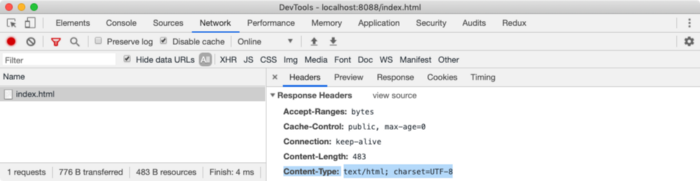

# How browser rendering works

**Research Question:**
How does a browser render HTML, CSS, JS to DOM? What is the mechanism behind it?

## Introduction:

Web browsers are the most used Software worldwide. In this paper, we will discuss how the rendering happens in the browser and how browsers work behind the scenes. We will see what happens when we type something in the search bar or address bar until we see the Google page on the browser screen. The browser blocks some rendering of a webpage until certain resources are loaded first and other resources get loaded asynchronously.

## Browser Rendering:

A Web browser is software that loads the files from the remote server or a local disk and displays them on the screen which allows us for user interaction. However, in the browser, there is a part of the software that figures out what should be displayed on the screen based on the type of files it receives. This is called the **Browser Engine**. The browser engine is the very important sub-software of every browser. There are different names for the engine given by Different browser manufacturers. E.g., Firefox calls their browser engine Gecko, and Chrome calls their engine Blink.

Whenever we are building a website, there are some things that are very important for a good user experience. A website may face Some of the common problems like slow loading of the resources, a flash of unstyled content (FOUC), on initial render waiting for unnecessary files to download, etc. Therefore We need to understand the life-cycle of how a browser renders a typical web page to avoid such problems.

We need to understand first what is DOM. Whenever a browser sends the request to the server to fetch an HTML document, then the server returns an HTML page in binary stream format which is simply a text file, with the response header Content-Typeset to the value text/Html; charset=UTF-8. Here text/Html is a MIME Type that tells the browser that it is an HTML document and charset=UTF-8 tells the browser that it is encoded in UTF-8 character encoding. the browser can convert the binary format into a readable text file Using this information.

## The main flow

The rendering engine will start getting the contents from the networking layer of the requested document. This will basically be done in 8kB chunks. This is the basic flow of the rendering engine after that. The rendering engine then will start to parse the HTML document and convert elements into the DOM nodes in the tree which is called as **Content Tree**. The engine will parse the style data in both external CSS files and style elements. Then the styling information in the HTML with the visual instructions will be used to create another tree which is the **Render Tree**.

The Render tree contains rectangles with visual attributes like dimensions and color. After the construction is done of the render tree it goes through a process called layout This means each node gets the exact coordinates of where it should appear on the screen. The render tree will get traversed and after that, each node will get painted using the UI backend layer in The next stage.

It is important to know that It is a gradual process. The rendering engine will try to display the contents on the screen as soon as possible for a better user experience. Therefore It will not wait until all the HTML is processed before it starts to build and layout the render tree. Some parts of the content will be displayed after parsing, and simultaneously the process stays there with the rest of the contents that keeps coming from the network as shown in the fig below.

## Document Object Model (DOM)

While the browser reads HTML code and whenever it encounters an HTML element like HTML, CSS, Body, Div, etc, it then creates a JavaScript object called a **Node**. All HTML elements will be converted to JavaScript objects eventually.

As we know every HTML element has different properties, the Node object will be created from the constructor functions of different classes. For example, the Node object for the div element is created from the HTMLDivElement which inherits the Node class. We can visualize these nodes using a simple test for our earlier HTML document. The browser comes with the built-in classes like HTMLDivElement, HTMLScriptElement , Node etc.

After the browser has created the Nodes from the HTML document, then it has to create a tree-like structure of these node objects. The browser needs to replicate that but using Node objects it has previously created because our HTML elements in the HTML file are nested inside each other. This will help the browser to efficiently render and manage the webpage throughout its lifecycle.

 

For our earlier HTML document, a DOM tree looks like the above image. A DOM tree starts from the top-most element of the tree which is the Html element and branches out as per the occurrence and nesting of the HTML elements in the document. Whenever any HTML element is found, it creates a DOM node object from their respective class constructor function. A DOM node is not always an HTML element. The browser also saves things like comments, attributes, text as separate nodes in the tree when it creates a DOM tree.

## Conclusion

In this paper, we have understood the basics of how the Browsers renders your HTML, CSS, and JS and what is the mechanism behind it. We also tried to understand different types of browser engines and their work.

## References

 - https://en.wikipedia.org/wiki/Browser_engine
 - https://developer.mozilla.org/en-US/docs/Web/API/Document_Object_Model/Introduction
 - https://medium.com/@mustafa.abdelmogoud/how-the-browser-renders-html-css-27920d8ccaa6
 - https://www.oncrawl.com/technical-seo/how-does-a-browser-create-a-web-page/
